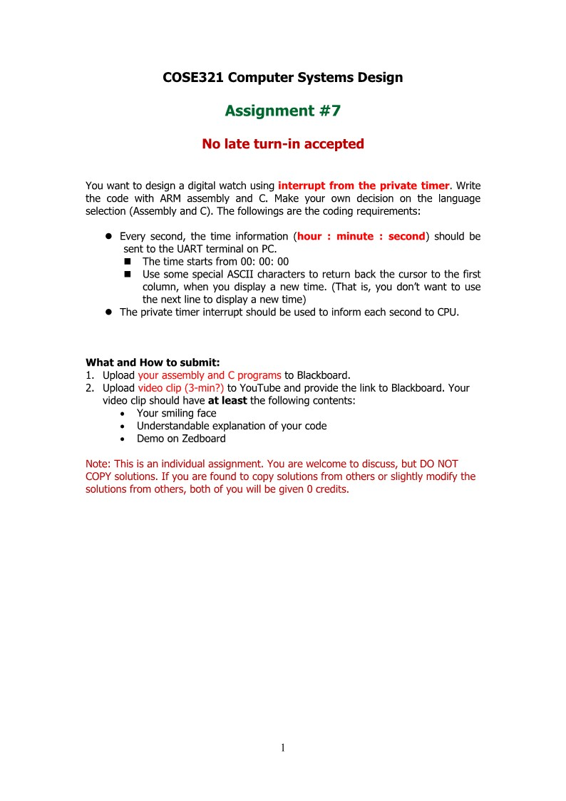

# COSE321 Computer Systems Design
### Assignment1

* **완료**
### Assignment2

* Sol -> 좀 더 공부필요
### Assignment3

* **완료**
### Assignment4

* **완료**
### Assignment5

* 진행예정 -> 일단 pass
### Assignment6

* 진행예정 -> 일단 pass
### Assignment7

* 진행예정
### Assignment8

* 진행예정
### Mini-Project

* 진행예정
